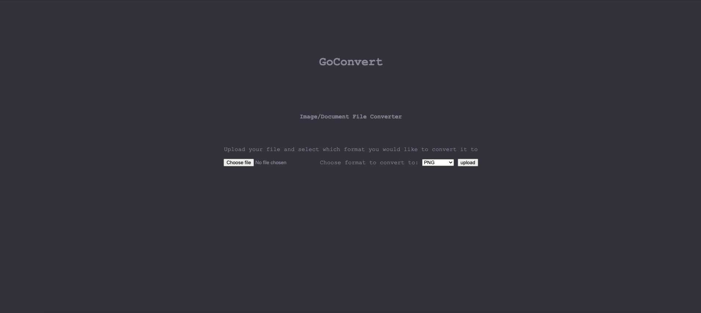
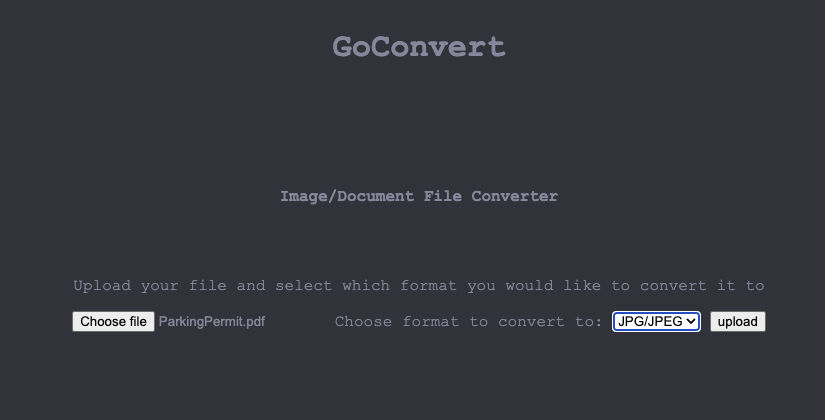
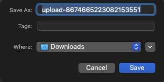
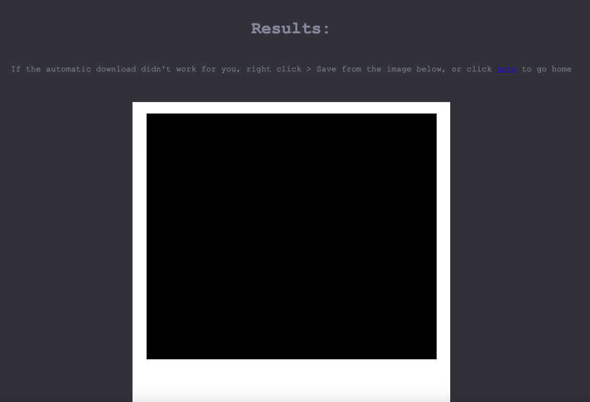

# goconvert
A simple, web-based file conversion tool written in Go!

The aim of this project is to provide a service to allow users to quickly and efficiently convert files from one format to another. The end goal is to have all of the modern features that people expect (drag-and-drop, amazing UI etc...) all whilst being incredibly fast.

I have recently (as of 24/08/2022) done a small re-write of the conversion functions, the aim of this was to utilise the disk as little as possible, as less interaction with the disk = faster conversion = better experience!

### How it works (from a user-perspective)
goconvert uses the built-in Go `net/http` package to spin up a simple but responsive http server. From here the user can navigate to `localhost:4433` - here they are greeted with a simple, easy-to-use interface.

From here the user can choose to upload a document (only PNG/JPG/PDF files are currently supported), the user then selects what format they want to convert to (again, only PNG/JPG/PDF at the moment) and the click `Upload`.

After a very small wait, the resulting image is automatically downloaded (or the user is prompted to select somewhere to save it, depending on the browser).

Once the user has downloaded the image (or are using a browser that doesn't support the auto-download feature), they are presented with a visual representation of the image. This is so that, should the user need/want to, they can download the image using the traditional `Right-click > Save as` method.

Once done, the user can then click the hyperlink seen in the text above the resulting image to go back home, this triggers the `handleCleanup()` function which removes all saved images/documents.

### Handling data
This program is _supposed_ to be run locally or on your own server. You _can_ run this on your server and have it open to the public however this is not advised (right now, at least) as there is no functionality to automatically cleanup the `images/` and `pdf/` directories and most users will probably take the downloaded file and leave the site, rather than click the home button again. This functionality will be added in the future and is a priority feature/fix.

### Breakdown
| File | Purpose |
| ---- | ------- |
| `main.go` | This file is the startpoint of the program, constant variables and structs are declared here along with the main() entrypoint function |
| `server.go` | This file handles all server-related functions, this includes functions to handle uploading, downloading and cleaning up of files as well as the creation of required directories (in case they don't exist!) |
| `convert.go` | This file contains all of the conversion functions, I thought to split this out from `server.go` to make it easier to focus on improving performance (as these are the performance bottlenecks) |
| `filesysops.go` | This file contains the os-level functions and operations such as creating directories and zipping image files |

### Things to improve
There's a lot. Mostly related to how the program handles PDF -> Image conversion

* Working out the number of pages of a PDF document takes a *very long* time. This relies on `imagemagick`'s `identify` program. To solve this issue, I will look for a go-native way to implement this, perhaps there's some sort of file-marker that denotes a new page in the PDF format - something to look into.
* Converting multiple pages of PDF into high-quality images (especially PNG format) takes a _long_ time. Writing JPG files is much faster however this may not be the preference for some users. I think most of this is down to how inefficient the PDF->Image conversion process is (times that by 100s of pages, and you're often waiting minutes just to write out all of the images)
* The resulting `.zip` file seems to end up containing a file called `image.zip` (an empty file, not an actual zip archive) - this could be down to the zipping process - should be easy-ish to remedy this issue.
* Pressing the "home" button after converting your files doesn't appear to cause the program to cleanup the files, despite network inspection confirming that the `/cleanup` url is called and returns a 301 to redirect the user home.